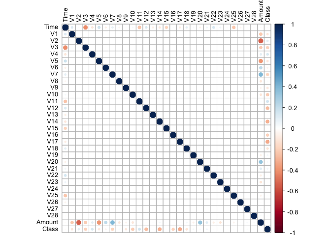
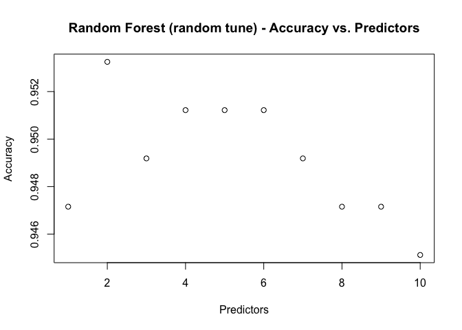

Credit Card Fraud Detection
================

Everyday there are millions of credit card transactions, most of which are legitimate. An important function of banks and credit card companies is to protect clients from becoming victims of credit card fraud, and to do so, try to predict which transactions are fraudulent. The performance of the predictions measured by the accuracy on number of instances predicted correctly over the total number of instances. However, false negative rate is definitely one of the most crucial key performance indicators, as it is costly to predicting a fraudulent transaction as a legitimate transaction.

One limitation of credit card analysis is the lack of available data, only a few datasets were available on Kaggle. The dataset “Credit Card Fraud Detection” is used for this project. This dataset consists of anonymized credit card transactions labeled as fraudulent or genuine under the column “Class”.

Objective of the Analysis
-------------------------

The objective of the analysis is to apply the techniques and models we have learned to the credit card dataset and compare them to see which model performs the best in identifying fraudulent transactions. The models we are comparing, based off our research, is the random forest (RF) model, support vector model (SVM), and generalized boosted model (GBM). Since this is a very unbalanced dataset, random undersampling was used to create a balanced dataset with 50-50 distribution on the Class (legitimate and fraudulent).

Research Questions
------------------

1.  What machine learning method will be the most effective at classifying transactions into the correct category? The metric used to answer this research question will be the accuracy rate which is defined as the percentage of transactions that was classified correctly.

2.  Which machine learning method will be the best at detecting fraudulent transactions? The metric used to answer this research question will be the false negative rate which is defined as the percentage of fraudulent transactions that were classified as legitimate over the total number of transactions that were classified as legitimate.

Data Files
----------

-   Credit card transactions: [creditcard.csv](https://www.kaggle.com/mlg-ulb/creditcardfraud/data)

Statistical Learning Approaches Used
------------------------------------

-   Random Forest
-   Support Vector Machine (SVM)
-   Gradient Boosting Machine (GBM)

Exploratory Data Analysis (EDA) and Data Pre-processing
-------------------------------------------------------

The dataset contains transactions made by credit cards in September 2013 by European cardholders. This dataset presents transactions with 492 frauds out of 284,807 transactions, which only account for 0.17% of all transactions. The dataset contains numeric input variables which are the result of a PCA transformation. Unfortunately, due to confidentiality issues, the original features about the data cannot be provided.

Features V1, V2, ...V28 are the principal components obtained with PCA, the only features which have not been transformed with PCA are 'Time' and 'Amount'. Feature 'Time' contains the seconds elapsed between each transaction and the first transaction in the dataset. The feature 'Amount' is the transaction Amount. Lastly, feature 'Class' is the response variable and it takes value 1 in case of fraud and 0 otherwise.

**Read File**

``` r
# set pwd
setwd('/Users/alexchen/achen/Waterloo/Academic/4A/afm423/Project/')

# library
library(caret)
library(corrplot)
library(ellipse)
library(e1071)
library(psych)
library(randomForest)
library(tibble)
library(knitr)

# read csv
creditcard <- read.csv('creditcard.csv')
```

**Size**

``` r
sprintf("Rows: %d, Columns: %d",nrow(creditcard), length(names(creditcard)))
```

    ## [1] "Rows: 284807, Columns: 31"

**View Dataset**

``` r
head(creditcard)
```

    ##   Time         V1          V2        V3         V4          V5          V6
    ## 1    0 -1.3598071 -0.07278117 2.5363467  1.3781552 -0.33832077  0.46238778
    ## 2    0  1.1918571  0.26615071 0.1664801  0.4481541  0.06001765 -0.08236081
    ## 3    1 -1.3583541 -1.34016307 1.7732093  0.3797796 -0.50319813  1.80049938
    ## 4    1 -0.9662717 -0.18522601 1.7929933 -0.8632913 -0.01030888  1.24720317
    ## 5    2 -1.1582331  0.87773675 1.5487178  0.4030339 -0.40719338  0.09592146
    ## 6    2 -0.4259659  0.96052304 1.1411093 -0.1682521  0.42098688 -0.02972755
    ##            V7          V8         V9         V10        V11         V12
    ## 1  0.23959855  0.09869790  0.3637870  0.09079417 -0.5515995 -0.61780086
    ## 2 -0.07880298  0.08510165 -0.2554251 -0.16697441  1.6127267  1.06523531
    ## 3  0.79146096  0.24767579 -1.5146543  0.20764287  0.6245015  0.06608369
    ## 4  0.23760894  0.37743587 -1.3870241 -0.05495192 -0.2264873  0.17822823
    ## 5  0.59294075 -0.27053268  0.8177393  0.75307443 -0.8228429  0.53819555
    ## 6  0.47620095  0.26031433 -0.5686714 -0.37140720  1.3412620  0.35989384
    ##          V13        V14        V15        V16         V17         V18
    ## 1 -0.9913898 -0.3111694  1.4681770 -0.4704005  0.20797124  0.02579058
    ## 2  0.4890950 -0.1437723  0.6355581  0.4639170 -0.11480466 -0.18336127
    ## 3  0.7172927 -0.1659459  2.3458649 -2.8900832  1.10996938 -0.12135931
    ## 4  0.5077569 -0.2879237 -0.6314181 -1.0596472 -0.68409279  1.96577500
    ## 5  1.3458516 -1.1196698  0.1751211 -0.4514492 -0.23703324 -0.03819479
    ## 6 -0.3580907 -0.1371337  0.5176168  0.4017259 -0.05813282  0.06865315
    ##           V19         V20          V21          V22         V23
    ## 1  0.40399296  0.25141210 -0.018306778  0.277837576 -0.11047391
    ## 2 -0.14578304 -0.06908314 -0.225775248 -0.638671953  0.10128802
    ## 3 -2.26185710  0.52497973  0.247998153  0.771679402  0.90941226
    ## 4 -1.23262197 -0.20803778 -0.108300452  0.005273597 -0.19032052
    ## 5  0.80348692  0.40854236 -0.009430697  0.798278495 -0.13745808
    ## 6 -0.03319379  0.08496767 -0.208253515 -0.559824796 -0.02639767
    ##           V24        V25        V26          V27         V28 Amount Class
    ## 1  0.06692807  0.1285394 -0.1891148  0.133558377 -0.02105305 149.62     0
    ## 2 -0.33984648  0.1671704  0.1258945 -0.008983099  0.01472417   2.69     0
    ## 3 -0.68928096 -0.3276418 -0.1390966 -0.055352794 -0.05975184 378.66     0
    ## 4 -1.17557533  0.6473760 -0.2219288  0.062722849  0.06145763 123.50     0
    ## 5  0.14126698 -0.2060096  0.5022922  0.219422230  0.21515315  69.99     0
    ## 6 -0.37142658 -0.2327938  0.1059148  0.253844225  0.08108026   3.67     0

**Statistics**

``` r
describe(creditcard)
```

    ##        vars      n     mean       sd   median  trimmed      mad     min
    ## Time      1 284807 94813.86 47488.15 84692.00 95361.03 63256.61    0.00
    ## V1        2 284807     0.00     1.96     0.02     0.22     1.77  -56.41
    ## V2        3 284807     0.00     1.65     0.07     0.07     1.04  -72.72
    ## V3        4 284807     0.00     1.52     0.18     0.09     1.39  -48.33
    ## V4        5 284807     0.00     1.42    -0.02    -0.06     1.19   -5.68
    ## V5        6 284807     0.00     1.38    -0.05    -0.03     0.97 -113.74
    ## V6        7 284807     0.00     1.33    -0.27    -0.18     0.83  -26.16
    ## V7        8 284807     0.00     1.24     0.04     0.01     0.83  -43.56
    ## V8        9 284807     0.00     1.19     0.02     0.06     0.38  -73.22
    ## V9       10 284807     0.00     1.10    -0.05    -0.03     0.92  -13.43
    ## V10      11 284807     0.00     1.09    -0.09    -0.06     0.71  -24.59
    ## V11      12 284807     0.00     1.02    -0.03    -0.01     1.11   -4.80
    ## V12      13 284807     0.00     1.00     0.14     0.10     0.75  -18.68
    ## V13      14 284807     0.00     1.00    -0.01     0.00     0.97   -5.79
    ## V14      15 284807     0.00     0.96     0.05     0.03     0.68  -19.21
    ## V15      16 284807     0.00     0.92     0.05     0.03     0.91   -4.50
    ## V16      17 284807     0.00     0.88     0.07     0.03     0.73  -14.13
    ## V17      18 284807     0.00     0.85    -0.07    -0.04     0.65  -25.16
    ## V18      19 284807     0.00     0.84     0.00     0.00     0.74   -9.50
    ## V19      20 284807     0.00     0.81     0.00     0.00     0.68   -7.21
    ## V20      21 284807     0.00     0.77    -0.06    -0.04     0.25  -54.50
    ## V21      22 284807     0.00     0.73    -0.03    -0.02     0.31  -34.83
    ## V22      23 284807     0.00     0.73     0.01     0.00     0.80  -10.93
    ## V23      24 284807     0.00     0.62    -0.01    -0.01     0.23  -44.81
    ## V24      25 284807     0.00     0.61     0.04     0.04     0.59   -2.84
    ## V25      26 284807     0.00     0.52     0.02     0.01     0.50  -10.30
    ## V26      27 284807     0.00     0.48    -0.05    -0.03     0.42   -2.60
    ## V27      28 284807     0.00     0.40     0.00     0.01     0.12  -22.57
    ## V28      29 284807     0.00     0.33     0.01     0.01     0.10  -15.43
    ## Amount   30 284807    88.35   250.12    22.00    41.64    29.98    0.00
    ## Class    31 284807     0.00     0.04     0.00     0.00     0.00    0.00
    ##              max     range  skew kurtosis    se
    ## Time   172792.00 172792.00 -0.04    -1.29 88.98
    ## V1          2.45     58.86 -3.28    32.49  0.00
    ## V2         22.06     94.77 -4.62    95.77  0.00
    ## V3          9.38     57.71 -2.24    26.62  0.00
    ## V4         16.88     22.56  0.68     2.64  0.00
    ## V5         34.80    148.54 -2.43   206.90  0.00
    ## V6         73.30     99.46  1.83    42.64  0.00
    ## V7        120.59    164.15  2.55   405.60  0.00
    ## V8         20.01     93.22 -8.52   220.58  0.00
    ## V9         15.59     29.03  0.55     3.73  0.00
    ## V10        23.75     48.33  1.19    31.99  0.00
    ## V11        12.02     16.82  0.36     1.63  0.00
    ## V12         7.85     26.53 -2.28    20.24  0.00
    ## V13         7.13     12.92  0.07     0.20  0.00
    ## V14        10.53     29.74 -2.00    23.88  0.00
    ## V15         8.88     13.38 -0.31     0.28  0.00
    ## V16        17.32     31.44 -1.10    10.42  0.00
    ## V17         9.25     34.42 -3.84    94.80  0.00
    ## V18         5.04     14.54 -0.26     2.58  0.00
    ## V19         5.59     12.81  0.11     1.72  0.00
    ## V20        39.42     93.92 -2.04   271.01  0.00
    ## V21        27.20     62.03  3.59   207.28  0.00
    ## V22        10.50     21.44 -0.21     2.83  0.00
    ## V23        22.53     67.34 -5.88   440.08  0.00
    ## V24         4.58      7.42 -0.55     0.62  0.00
    ## V25         7.52     17.81 -0.42     4.29  0.00
    ## V26         3.52      6.12  0.58     0.92  0.00
    ## V27        31.61     54.18 -1.17   244.98  0.00
    ## V28        33.85     49.28 11.19   933.37  0.00
    ## Amount  25691.16  25691.16 16.98   845.07  0.47
    ## Class       1.00      1.00 24.00   573.87  0.00

**Distribution for Response Variable**

``` r
attach(creditcard)
table(Class)
```

    ## Class
    ##      0      1 
    ## 284315    492

Class 0 (legitimate) has 284315 observations comparing to 492 observations of Class 1 (fraudulent).

The following graph shows the frequency of class as it is highly imbalanced with 99.83% to 0.17%.


Later, we will use random undersample method to fix this problem.

**Correlation** 

-   ‘Amount’ and ‘V2’ has a high negative correlation
-   ‘Amount’ and ‘V7 has a relatively high positive correlation
-   ‘Amount’ and ‘V20’ also has a relatively high positive correlation

**Scatter Plot Matrix**


This graph shows the data points for features ‘V1’ to ‘V4’ plotting against each other in a matrix. Two clear ellipses are formed for the data points in each class. We can see that each class distinguishes from each other.

**Box Plot**


The data distribution for features ‘V1’ to ‘V4’ in each class are different. We can see that there is a big different when comparing each class distribution.

Data Preparation
----------------

``` r
# set seed
set.seed(123456789)

# undersampling
creditcard$Class <- as.factor(creditcard$Class)
class_0_idx = which(creditcard$Class == 0) # legitimate
class_1_idx = which(creditcard$Class == 1) # fraudulent
nsamp = length(class_1_idx) # 492 obs

class_0_idx_under_sample = sample(class_0_idx, nsamp)
creditcard_undersample = creditcard[c(class_0_idx_under_sample,class_1_idx), ]
creditcard_undersample = creditcard_undersample[, -1]  # remove time column for training

# split train and test data
train_index = sample(1:nrow(creditcard_undersample), size = round(0.5 * nrow(creditcard_undersample)))
creditcard_trn = creditcard_undersample[train_index, ]
creditcard_tst = creditcard_undersample[-train_index, ]

# split X and Y into a factor and a matrix
trn_X = as.matrix(creditcard_trn[, -1])
trn_y = as.factor(creditcard_trn$Class)
```

A seed of 123456789 will be used throughout the project. When undersampling, a random sample of 492 observations are draw from the legitimate transactions. A total of 984 observations (492 legitimate and 492 fraudulent) will be the new dataset, which will be used for training and testing predictive models for the project.

**Undersample Data Visualization**

``` r
attach(creditcard_undersample)
```

    ## The following objects are masked from creditcard:
    ## 
    ##     Amount, Class, V1, V10, V11, V12, V13, V14, V15, V16, V17,
    ##     V18, V19, V2, V20, V21, V22, V23, V24, V25, V26, V27, V28, V3,
    ##     V4, V5, V6, V7, V8, V9

``` r
table(Class)
```

    ## Class
    ##   0   1 
    ## 492 492


After undersampling, the graph shows the frequency of class with 50% to 50% equal distribution for each class.

Helper Functions
----------------

There are three helper functions defined that will be used throughout the research.

``` r
# Get the test classification accuracy 
get_class_acc = function(model, data, response) {
    mean(data[,response] == predict(model,data))
}

# Get the false negative rate
get_false_negative_rate = function(model, data, response) {
    cm = confusionMatrix(predict(model,data),data[,response])
    fn = cm$table[1,2]
    tp = cm$table[1,1]
    fn/(tp+fn)
}
```

Models
------

I. Random Forest
================

``` r
# random forest with tuning 1:10 
# finding the best mtry with tune grid; best value: 5
cc_rf_tuned = train(Class~., data=creditcard_trn, 
                    trControl=trainControl(method="oob"),
                    method = "rf", tuneGrid =expand.grid(mtry=1:10))
```


``` r
# random forest with random tuned 
cc_rf_random_tuned_tunelength10 = train(Class~., data=creditcard_trn, 
                           trControl=trainControl(method="oob"),
                           method = "rf", tuneLength = 10)
```



The figure on the left is the random forest training model with mtry from 1 to 10. The best predictor is 5. The figure on the right is the random forest training model with random tune, which shows best predictor to be 2.

``` r
#   Type of random forest: classification
#   Number of trees: 500
#   No. of variables tried at each split: 5
#   SQRT(30)=5.4

cc_rf = randomForest(Class~., 
                     data=creditcard_trn,
                     mtry = 5, 
                     importance = TRUE, 
                     ntrees = 500)
```


This is the error rate compared to the number of trees generated. Interestingly, the lowest error rate is about 0.07 between 0-50 trees, lower than the average approximately 0.08 that is in the range of the 100-500 trees.

``` r
# predicting with the test data 
cc_rf_tst_pred = predict(cc_rf, newdata = creditcard_tst)
```


Predicted to actual classifications on test data. This model appears to have good accuracy.

``` r
# random forest with CV
cc_rf_cv = train(Class~., data=creditcard_trn, trControl=trainControl(method="cv",number=10), method="rf", tuneLength=10)
```


Random forest with cross validation accuracy and predictors comparison. It seems that for cross validation the best number of predictors is approximately 7.

``` r
# making list of models 
model_list = list(cc_rf_tuned, cc_rf_random_tuned_tunelength10, cc_rf_cv)

# Get Test Accuracy
test_rmse = sapply(model_list, get_class_acc, data = creditcard_tst, response = "Class")
fnr = sapply(model_list, get_false_negative_rate, data = creditcard_tst, response = "Class")
results = data.frame(
    titles = c("cc_rf_tuned",
        "cc_rf_random_tuned_tunelength10",
        "cc_rf_cv"),
    test_rmse,
    fnr
)

colnames(results) = c("model", "test accuracy","false negative rate")
knitr::kable(results, escape = FALSE, booktabs = TRUE)
```

| model                               |  test accuracy|  false negative rate|
|:------------------------------------|--------------:|--------------------:|
| cc\_rf\_tuned                       |      0.9146341|            0.1333333|
| cc\_rf\_random\_tuned\_tunelength10 |      0.9105691|            0.1370370|
| cc\_rf\_cv                          |      0.9085366|            0.1375465|

From the test accuracies, cc\_rf\_tuned has the greatest test accuracy and lowest false negative rate, which makes it the most accurate model of the three. The tune for cf\_rf\_tuned is 5.

II. SVM
=======

10 fold cross validation is used to help train the svm model to generalize better.

``` r
# Setting up the train control for SVM
trnCtrl = trainControl(method="cv",number = 10)

# SVM with linear kernel before preprocessing
svm_linear = train(Class ~.,
    data = creditcard_trn,
    method = "svmLinear",
    trControl = trnCtrl,
    tuneGrid = expand.grid(C = c(2 ^ (-2:5))))

# SVM with linear kernel after preprocessing
svm_linear_preprocess = train(Class ~ .,
    data = creditcard_trn,
    method = "svmLinear",
    trControl=trnCtrl,
    preProcess = c("center","scale"),
    tuneGrid = expand.grid(C = c(2 ^ (-2:5))))
```

Using a linear kernel with SVM where the tune grid has varying values for the cost.


Graph shows the relationship between cost and accuracy for a SVM model with a linear kernel and no preprocessing of data. The highest accuracy happens at the lowest cost.


Graph shows the relationship between cost and accuracy for a SVM model with a linear kernel and preprocessing of data. The highest accuracy happens at the second lowest cost of 0.5.

``` r
# SVM with radial kernel before preprocessing
svm_radial = train(Class ~ .,
    data = creditcard_trn,
    method = "svmRadial",
    trControl=trnCtrl,
    tuneLength = 10)

# SVM with a radial kernel after preprocessing
svm_radial_preprocess = train(Class ~ .,
    data = creditcard_trn,
    method = "svmRadial",
    trControl = trnCtrl,
    preProcess = c("center", "scale"),
    tuneLength = 10)
```

Using a radial kernel with SVM. The ‘tuneLength’ parameter specifies the total number of tuning parameters used.


Graph shows the relationship between cost and accuracy for a SVM model with a radial kernel and no preprocessing of data. Best accuracy happens at a cost of 2.


Graph shows the relationship between cost and accuracy for a SVM model with a radial kernel and preprocessing of data. Best accuracy happens at a cost of 2.

``` r
# SVM with a polynomial kernel before preprocessing
svm_poly = train(Class ~ .,
    data = creditcard_trn,
    method = "svmPoly",
    trControl = trnCtrl,
    tuneLength = 5)

# SVM with a polynomial kernel after preprocessing
svm_poly_preprocess = train(Class ~ .,
    data = creditcard_trn,
    method = "svmPoly",
    trControl = trnCtrl,
    preProcess = c("center", "scale"),
    tuneLength = 5)
```

Use a polynomial kernel with SVM. The ‘tunelength’ parameter specifies the number of tuning parameters used.


Graph shows the relationship between tuning parameters (cost, degree, and scale) for a SVM model with a polynomial kernel and no preprocessing of data.


Graph shows the relationship between tuning parameters (cost, degree, and scale) for a SVM model with a polynomial kernel and preprocessing of data.

``` r
# SVM with weighted costs (emphasize on fraudulent transactions)
costs = table(creditcard_trn$Class)
# Legitimate transactions
costs[1] = 1
# Fraudulent transactions
costs[2] = 1e10
svm_weighted_cost = svm(Class ~ .,
                        data = creditcard_trn,
                        type = 'C-classification',
                        kernel = 'polynomial',
                        class.weights=costs,
                        degree = 1,
                        scale=FALSE,
                        cross = 10)
```

The weighted cost tries to put an emphasis on fraudulent transactions to decrease the false negative rate.

``` r
# Creating a list of trained models
model_list = list(svm_linear,
    svm_linear_preprocess,
    svm_radial,
    svm_radial_preprocess,
    svm_poly,
    svm_poly_preprocess,
    svm_weighted_cost)

# Getting test accuracy
test_rmse = sapply(model_list, get_class_acc, data = creditcard_tst, response = "Class")
fnr = sapply(model_list, get_false_negative_rate, data = creditcard_tst, response = "Class")
results = data.frame(
    titles = c("svm linear",
        "svm linear (preprocess)",
        "svm radial",
        "svm radial (preprocess)",
        "svm poly",
        "svm poly (preprocess)",
        "svm poly weighted cost"),
    test_rmse,
    fnr
)
colnames(results) = c("model", "test accuracy","false negative rate")
knitr::kable(results, escape = FALSE, booktabs = TRUE)
```

| model                   |  test accuracy|  false negative rate|
|:------------------------|--------------:|--------------------:|
| svm linear              |      0.9044715|            0.1185771|
| svm linear (preprocess) |      0.9126016|            0.1338290|
| svm radial              |      0.9085366|            0.1348315|
| svm radial (preprocess) |      0.9085366|            0.1375465|
| svm poly                |      0.9126016|            0.1365314|
| svm poly (preprocess)   |      0.9065041|            0.1380597|
| svm poly weighted cost  |      0.8760163|            0.0913242|

This creates a nice table that contains the test accuracy (answer to research question 1) and false negative rate (answer to research question 2) for each SVM model that was generated.

The best performing kernel in terms of accuracy was the linear kernel or the polynomial kernel with a degree of 1 (which is essentially a linear kernel) and no preprocessing of data. The best performing kernel had an accuracy of 91.26% and a 13.38% false negative rate. Both the accuracy and the false negative rate are the highest when compared to all other SVM models without a weighted class cost. When giving a higher cost weight to fraudulent transactions, the accuracy slightly decreases to 87.60%, but the false negative rate also decreases to 9.13%. If false negative rate is determined to be more important than accuracy metrics, then the SVM with a weighted class cost should be used.

III. GBM
========

``` r
# Setting up the tune grid for the GBM model
gbm_grid = expand.grid(interaction.depth = 1:5,
                       n.trees = (1:30) * 100, 
                       shrinkage = c(0.001, 0.1, 0.5),     
                       n.minobsinnode = 10) 

# GBM Model
creditcard_gbm_mod = train(   
    Class ~ .,   
    data = creditcard_trn,   
    trControl = trainControl(method="cv",number = 5),   
    method = "gbm",   
    tuneGrid = gbm_grid,    
    verbose = FALSE )

# GBM Model with preprocessing
creditcard_gbm_mod_preprocess = train(   
    Class ~ .,   
    data = creditcard_trn,   
    trControl = trainControl(method="cv",number = 5),   
    method = "gbm",   
    tuneGrid = gbm_grid,
    preProcess = c("center","scale"),    
    verbose = FALSE )
```

Training Two GBM Model with and without preprocessing.

**Relative influence with tune grid** 

    ## # A tibble: 29 x 2
    ##    var   rel.inf
    ##  * <fct>   <dbl>
    ##  1 V14     68.0 
    ##  2 V4      10.2 
    ##  3 V11      6.33
    ##  4 V10      2.37
    ##  5 V19      1.49
    ##  6 V12      1.46
    ##  7 V17      1.17
    ##  8 V3       1.13
    ##  9 V18      1.12
    ## 10 V7       1.00
    ## # ... with 19 more rows

Graph shows the relative influence of the data provided for creditcard.csv. From the chart V14 has the highest relative influence.

**GBM Result Summary** 

Graph shows the relationship between iterations and accuracy for a GBM model. Best accuracy happens with a shrinkage of 0.100 and 1500 iterations.

**GBM with Preprocessing Result Summary** 

Graph shows the relationship between iterations and accuracy for a GBM model with preprocessing. Best accuracy happens with a shrinkage of 0.100 and 1500 iterations.

``` r
# Creating a list of trained models
model_list = list(creditcard_gbm_mod, creditcard_gbm_mod_preprocess)

# Getting test accuracy
test_rmse = sapply(model_list, get_class_acc, data = creditcard_tst, response = "Class")
fnr = sapply(model_list, get_false_negative_rate, data = creditcard_tst, response = "Class")
results = data.frame(
    titles = c("gbm_mod","gbm_mod_preprocess"),
    test_rmse,
    fnr
)

colnames(results) = c("model", "test accuracy","false negative rate")
knitr::kable(results, escape = FALSE, booktabs = TRUE)
```

| model                |  test accuracy|  false negative rate|
|:---------------------|--------------:|--------------------:|
| gbm\_mod             |      0.9065041|            0.1150794|
| gbm\_mod\_preprocess |      0.9085366|            0.1115538|

Table that contains the test accuracy (answer to research question 1) and false negative rate (answer to research question 2) for each GBM model that was generated.

Conclusion
----------

| Model                   | Test Accuracy | False Negative Rate |
|:------------------------|:--------------|:--------------------|
| RF Tuned                | 0.9146341     | 0.1333333           |
| RF Tunelength10         | 0.9105691     | 0.1370370           |
| RF Cross Validation     | 0.9085366     | 0.1375465           |
| SVM Linear              | 0.9126016     | 0.1338290           |
| SVM Linear (Preprocess) | 0.9105691     | 0.1343284           |
| SVM Radial              | 0.9085366     | 0.1375465           |
| SVM Radial (Preprocess) | 0.9085366     | 0.1375465           |
| SVM Poly                | 0.9126016     | 0.1338290           |
| SVM Poly (Preprocess)   | 0.9105691     | 0.1370370           |
| SVM Poly Weighted Cost  | 0.8760163     | 0.0913242           |
| GBM                     | 0.9024390     | 0.1160000           |
| GBM with Scaling        | 0.9085366     | 0.1052632           |

Based on the result generated by various models, **Random Forest Tuned** is the best model at classifying credit card transactions into the correct classes with an accuracy of 91.5%.

On the other hand, **SVM Poly Weighted Cost** is the best model at detecting fraudulent credit card transaction by monitoring false negative rate. It has a false negative rate of 9.1% and an accuracy of 87.6%.
